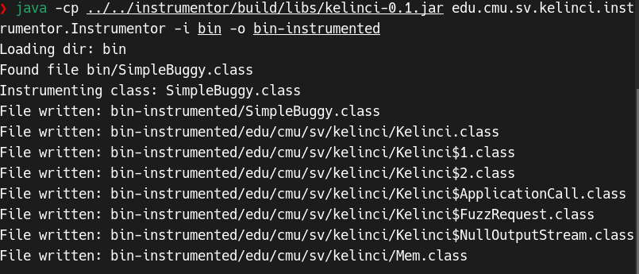
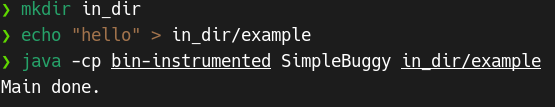
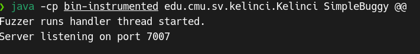
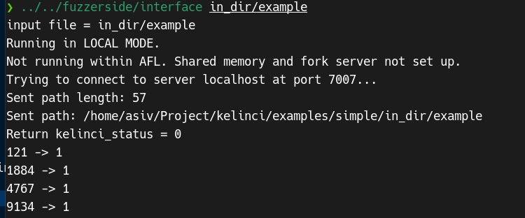
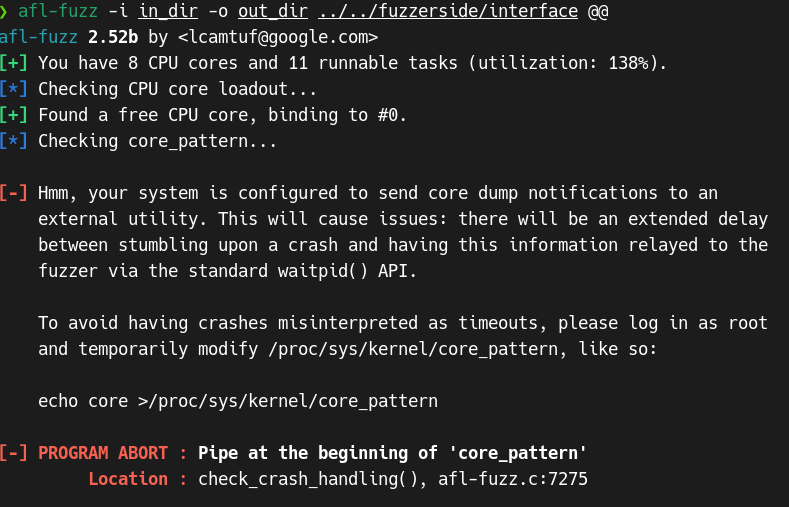
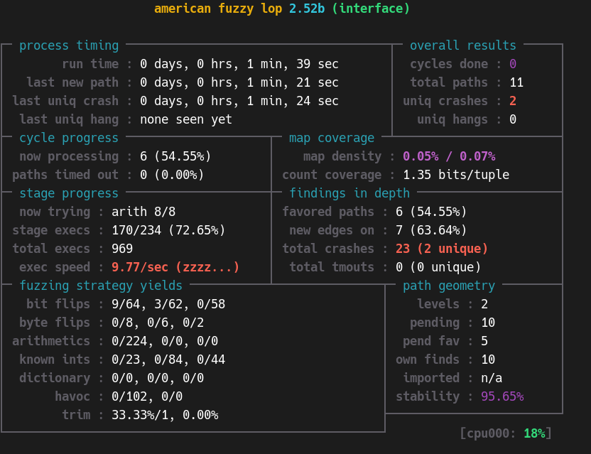

# Kelinci fuzzing usage introdution

## casetest

### simple

**1.编译simple源码**

```bash
mkdir bin
javac src/*.java -d bin
```

**2.插装**

simple的编译结果目录为为'bin'。我们的下一步是为使用Kelinci而对类进行插桩。Kelinci提供了edu.cmu.sv.kelinci.instrumentor.Instrumentor类来实现这一点。它在`-i`标志后面接受一个输入目录（这里是'bin'），在`-o`标志后面接受一个输出目录（这里是'bin-instrumented'）。我们需要确保kelinci JAR在类路径上，以及目标应用程序的所有依赖项。假设目标应用程序依赖的JAR位于/path/to/libs/，则插桩的命令如下所示：

```bash
java -cp /path/to/kelinci/instrumentor/build/libs/kelinci.jar:/path/to/libs/* edu.cmu.sv.kelinci.instrumentor.Instrumentor -i bin -o bin-instrumented
```

由于这个程序比较简单，没有什么依赖，因此我们无需指定依赖路径，直接输出插装结果，命令如下

```bash
mkdir bin-instrumented
java -cp ../../instrumentor/build/libs/kelinci-0.1.jar edu.cmu.sv.kelinci.instrumentor.Instrumentor -i bin -o bin-instrumented
```



插桩的结果已经写出

**3. 创建示例输入**
我们现在想测试被插桩的Java应用程序是否正常工作。为此，我们创建一个示例输入文件的目录：

```bash
mkdir in_dir
```

AFL稍后将使用此目录来获取它将变异的输入文件。因此，将有代表性的输入文件放在那里是非常重要的。

我们先看一下这个程序的源码

```java
import java.io.FileInputStream;
import java.io.FileNotFoundException;
import java.io.IOException;

/**
 * Just a program with some branches, so lots of different behaviors.
 * It contains a bug that is triggered when the first byte of the input
 * is 2.
 * 
 * @author Rody Kersten
 */
public class SimpleBuggy {

	// 2 paths
	public void doIf(int n) {
		if (n == 2) {
			throw new RuntimeException("Crash!");
		}
	}

	// since n <= 9, 10 paths
	public void doFor(int n) {
		for (int i = 0; i < n; i++) {
			int y = 0;
		}
	}

	// 3 paths
	public int doLookupSwitch(int n) {
		int z;

		// lookup switch
		switch(n) {
		case 2:  z = 4; break;
		case 4: z = 7; break;
		default: z = -1;
		}
		
		return z;
	}

	// 4 paths
	public int doTableSwitch(int n) {
		int z;

		// table switch
		switch(n) {
		case 1: z = 1; break;
		case 2: z = 2; break;
		case 3: z = 3; break;
		default: z = -1;
		}
		
		return z;
	}
	
	/**
	 * Parses 4 characters from a file as integers and calls the above methods.
	 **/
	public static void main(String args[]) {

		SimpleBuggy x = new SimpleBuggy();
		try (FileInputStream stream = new FileInputStream(args[0])) {
			x.doIf((stream.read()-'0') % 10);
			x.doFor((stream.read()-'0') % 10);
			x.doLookupSwitch((stream.read()-'0') % 10);
			x.doTableSwitch((stream.read()-'0') % 10);
		} catch (FileNotFoundException e) {
			// TODO Auto-generated catch block
			e.printStackTrace();
		} catch (IOException e) {
			// TODO Auto-generated catch block
			e.printStackTrace();
		}
		System.out.println("Main done.");
	}
}
```

**doIf方法：**

- 输入参数为n，如果n等于2，则抛出RuntimeException("Crash!")异常。

**doFor方法：**

- 输入参数为n，使用for循环执行n次，每次循环中有一个int类型的变量y赋值为0。

**doLookupSwitch方法：**

- 输入参数为n，使用lookup switch结构，根据n的不同值执行不同的分支。如果n等于2，则z被赋值为4；如果n等于4，则z被赋值为7；否则，z被赋值为-1。

**doTableSwitch方法：**

- 输入参数为n，使用table switch结构，根据n的不同值执行不同的分支。如果n等于1，则z被赋值为1；如果n等于2，则z被赋值为2；如果n等于3，则z被赋值为3；否则，z被赋值为-1。

**main方法：**

- 程序的入口方法，从命令行参数中读取文件名，并通过FileInputStream读取文件内容。
- 从文件中读取4个字符，将每个字符转换为整数并传递给doIf、doFor、doLookupSwitch和doTableSwitch方法。
- 如果文件的第一个字符是2，doIf方法会抛出RuntimeException("Crash!")异常。
- 文件读取完成后，输出"Main done."。

程序的漏洞点在于RuntimeException

```bash
❯ mkdir in_dir
❯ echo "hello" > in_dir/example
```

**4.测试Java应用程序**

查看被插桩的Java应用程序是否能够使用提供/创建的输入文件正常工作：

```bash
java -cp bin-instrumented SimpleBuggy in_dir/example
```

可以发现成功运行



**5. 启动Kelinci服务器**

我们现在可以启动Kelinci服务器了。我们将简单地编辑上面的命令，它运行了Java应用程序。Kelinci期望目标应用程序的主类作为第一个参数，因此我们现在只需在那个之前添加Kelinci的主类。我们还需要将具体的文件名替换为`@@`，Kelinci将用它写入的输入文件的实际路径替换它。其他参数可以保持不变，将在运行中固定。

```bash
java -cp bin-instrumented edu.cmu.sv.kelinci.Kelinci SimpleBuggy @@
```



**6. 可选：测试接口**

```bash
../../fuzzerside/interface in_dir/example
```



**7. 启动fuzzing！**

```bash
mkdir out_dir
afl-fuzz -i in_dir -o out_dir ../../fuzzerside/interface @@
```

会输出报错



解决方法

[coredump - AFL fuzzing without root - avoid modifying /proc/sys/kernel/core_pattern - Stack Overflow](https://stackoverflow.com/questions/35441062/afl-fuzzing-without-root-avoid-modifying-proc-sys-kernel-core-pattern)

```bash
sudo su
echo core >/proc/sys/kernel/core_pattern
exit
```

再重新执行上面的命令



### CVE-2017-15700


```
java -cp bin-instrumented:/home/asiv/Project/fuzzing/casetest/src/pro/target/lib/* org.apache.sling.Main in_dir/seed.txt

zsh: no matches found: bin-instrumented:/home/asiv/Project/fuzzing/casetest/src/pro/target/lib/*
```

由于我用的终端程序是`zsh`,`zsh`会尝试扩展通配符，但命令中使用了通配符`*`因此,`zsh`无法找到匹配的文件。


所以这里`classpath`或者`cp`后面的库需要用`""`

连接
```
java -cp "bin-instrumented:/home/asiv/Project/fuzzing/casetest/src/pro/target/lib/*" edu.cmu.sv.kelinci.Kelinci org.apache.sling.Main @@
```


```
afl-fuzz -i in_dir -o out_dir /home/asiv/Project/kelinci/fuzzerside/interface @@
```

## 参考文献

